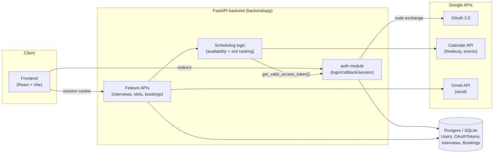

# Architecture

## Stack

| Layer | Choice | Why |
|---|---|---|
| Backend | Python + FastAPI | Async-native, typed request/response models via Pydantic, mature Google API client libraries (`google-auth`, `google-api-python-client`) that we depend on heavily. |
| ORM / migrations | SQLAlchemy + Alembic | Explicit schema, reviewable migrations — important with several people extending the same tables (`Interview` especially). |
| Database (dev) | SQLite (`backend/dev.db`) | Zero setup — anyone can clone and run without installing a DB server. |
| Database (prod / scale demo) | PostgreSQL | Needed the moment any feature relies on row-level locking (`SELECT ... FOR UPDATE` when creating an interviewer offer — see [WORKFLOW.md](WORKFLOW.md#6-n-seat-interviewer-assignment)) or handles concurrent writers. SQLite's locking is coarser (whole-file), which is fine for a single-dev happy-path demo but not for proving the race-condition guard actually works. |
| Auth | Google OAuth 2.0 (Authorization Code + offline access) | We need standing access to Calendar/Gmail on the user's behalf *after* they've left the browser (background scheduling, reminders) — that requires a refresh token, which only the offline-access OAuth flow provides. See [AUTH_MODULE.md](AUTH_MODULE.md). |
| External APIs | Google Calendar API, Gmail API | Free/busy checks, event creation with Meet conferencing, and sending notifications, all through the same Google identity a user already has. |
| Frontend | React 18 + Vite (plain JS/JSX, no TypeScript), React Router v6, CSS Modules + a shared design-token stylesheet (no Tailwind/component library) | Small, fixed page count so far didn't justify a heavier toolchain; see [FRONTEND_DESIGN_SYSTEM.md](FRONTEND_DESIGN_SYSTEM.md) for the full reasoning and the tokens/components every new page should build on. |

## System diagram

The key architectural rule: **feature modules never talk to Google or hold
tokens directly.** Every Calendar/Gmail call goes through
`google_oauth.get_valid_access_token(db, user_id)` in the auth module, which
handles refreshing an expiring token and raises a typed `ReauthRequired`
exception if the connection is dead. This keeps token lifecycle logic in one
auditable place instead of scattered across every module that needs Google
access — see [AUTH_MODULE.md](AUTH_MODULE.md#using-auth-from-your-module).

## Trade-offs (be ready to explain these in your module's walkthrough)

**Why FastAPI over Node/Express?**
Team familiarity with Python, and the Google API Python client libraries are
more mature/better documented than their Node equivalents for the specific
combination we need (OAuth + Calendar + Gmail together). Node would've been an
equally reasonable choice — this wasn't a technical necessity, it was a team
call made early and everything is now built on it.

**Why SQL (Postgres) over NoSQL?**
The core data is inherently relational — interviews have participants, which
have availability windows, which produce offers, which reference calendar
events. Modeling that in a document store means duplicating relationships or
doing joins in application code. We also need transactional guarantees (the
interviewer-assignment lock, see below) that SQL gives natively.

**Why rank-and-offer-to-top-N instead of broadcasting to the whole interviewer
pool at once?**
An earlier version of this design had the system notify every eligible pool
member simultaneously and let whoever accepted first claim a seat — that
needs a seats-counter race guard (many simultaneous acceptances competing for
a limited number of seats), and it optimizes for "who clicked fastest"
rather than fairness, which fights the load-balancing goal directly (the
fastest responder isn't necessarily the least-loaded one). We settled on a
middle ground: rank the eligible-and-feasible pool by load, and offer to
**exactly** the top N — one offer per open seat, never more. This keeps the
determinism and fairness of a pure sequential design (only ever N offers
outstanding, no seats-counter race) while still being as fast as a broadcast
in the common case where all N invited people simply accept. The one
remaining race — two *different* interviews independently offering the same
top-ranked person overlapping times — is guarded by a per-interviewer row
lock at offer-creation time, not a seats counter. A decline or timeout on any
one seat cascades only that seat to the next-ranked candidate; the other
confirmed seats are untouched. Trade-off: a cascade through several declines
on one seat is slower than a broadcast would be for *that* seat — acceptable
for interview scheduling, where minutes of extra latency don't matter, but
would be the wrong call for something latency-sensitive.

**Why REST over GraphQL?**
Small, fixed set of resources (interviews, slots, bookings) with no deep
nested-query needs from the frontend — GraphQL's flexibility would be paying
for a problem we don't have, at the cost of more setup time we don't have
either.

**Monolith vs. microservices?**
Single FastAPI app with clearly separated modules (`auth/`, and one folder per
feature module going forward), not a monolith-as-one-file and not
microservices. Guideline #2 asks for "clear separation of concerns," not
network-separated services — splitting into real microservices during a
hackathon would spend the clock on deployment/ops instead of the actual
scheduling logic that's being evaluated.

**What breaks first at 100,000 active users?**
In order: (1) SQLite — falls over almost immediately under concurrent writes,
must be Postgres; (2) the naive Free/Busy-per-request pattern — hitting
Google's Calendar API synchronously on every availability check will hit rate
limits fast, needs caching/batching; (3) a single-instance FastAPI process —
needs horizontal scaling behind a load balancer, with sessions validated via
JWT (already stateless — no server-side session store to bottleneck) so this
part actually scales cleanly already.
