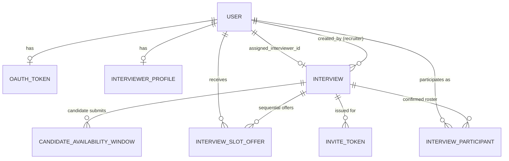

# Data Model

Source of truth is always `backend/app/db/models.py` — this doc explains the
*why* behind it; if the two disagree, the code is right and this doc is stale
(fix the doc).

**Status:** `User`, `OAuthToken` are built. `Interview` and `InviteToken`
exist as minimal stubs (see below) — everything else on this page is **spec
for Module 2 onward, not yet in code.** Build against this spec; don't treat
its absence from `models.py` as a discrepancy to "fix" without discussion,
since it reflects the interviewer-pooling redesign (see
[WORKFLOW.md](WORKFLOW.md#what-changed-from-the-original-plan)).

## Tables that exist today (built)

### `User`
One row per person, regardless of role.

| Column | Type | Notes |
|---|---|---|
| `id` | string (UUID) | PK |
| `google_id` | string, unique | Google's `sub` claim — the stable identity key, not email |
| `email` | string, unique | |
| `name` | string | |
| `role` | enum: `candidate`, `recruiter`, `hiring_manager`, `interviewer` | Set once at first login, see [AUTH_MODULE.md](AUTH_MODULE.md) |
| `status` | enum: `active`, `disabled` | Not enforced anywhere yet |
| `created_at` | datetime | |

### `OAuthToken`
One row per user (1:1), holding their Google tokens. See
[AUTH_MODULE.md](AUTH_MODULE.md) — never query this outside
`app/auth/google_oauth.py`.

## Tables to add (spec for Module 2 onward)

### `Interview` (extend the existing stub)
Currently just `id, title, status, created_by, created_at`. Extend with:

| Column | Type | Notes |
|---|---|---|
| `interview_type` | enum: `SCREENING`, `TECHNICAL_ROUND_1`, `TECHNICAL_ROUND_2`, `MANAGERIAL`, `HR` (extend as needed) | |
| `required_skills` | JSON array of strings | e.g. `["React", "System Design"]` — matched against `InterviewerProfile.skills` |
| `required_seniority` | enum: `JUNIOR`, `MID`, `SENIOR`, `STAFF` | minimum seniority to be pool-eligible |
| `hiring_manager_id` | string, FK → `users.id`, nullable | named explicitly by the recruiter, **not** pool-matched |
| `assigned_interviewer_id` | string, FK → `users.id`, nullable | set once Stage 6 lands an acceptance; null while unassigned/mid-cascade |
| `candidate_email`, `candidate_timezone` | string | |
| `duration_minutes`, `buffer_minutes` | int | |
| `status` | enum: `draft`, `collecting_availability`, `awaiting_candidate_selection`, `assigning_interviewer`, `scheduled`, `cancelled`, `completed`, `needs_recruiter_action` | `needs_recruiter_action` = Stage 6's pool exhausted or Stage 4 found zero feasible slots |
| `confirmed_start_utc`, `confirmed_end_utc` | datetime, nullable | set once Stage 6 completes. Kept directly on `Interview` rather than a separate `Booking` table since an interview has at most one *active* confirmed time; a reschedule replaces these values rather than creating a parallel row |
| `calendar_event_id`, `meeting_link` | string, nullable | set by Module 7 after creating the Calendar event |

No panelist-count field — every interview needs exactly one
`assigned_interviewer_id`, filled by Stage 6.

### `InterviewerProfile` (new — Module 2B)
One row per interviewer, separate from `User` so not every user needs pool
metadata (candidates/recruiters don't have one).

| Column | Type | Notes |
|---|---|---|
| `id` | string (UUID) | PK |
| `user_id` | string, FK → `users.id`, unique | must be a `User` with `role = interviewer` |
| `skills` | JSON array of strings | self-declared or admin-set |
| `seniority` | enum: `JUNIOR`, `MID`, `SENIOR`, `STAFF` | |
| `qualified_interview_types` | JSON array of the `interview_type` enum values | which rounds this person can run |
| `active` | bool, default true | opt-out toggle for "don't assign me right now" (leave, overloaded) — independent of calendar busy/free |
| `updated_at` | datetime | |

**No `current_weekly_interviews` or `last_interview_at` columns here** —
deliberately. Both are **computed live from `InterviewParticipant`**, not
stored counters:

```
current_load(interviewer)   = COUNT(InterviewParticipant
                                     WHERE user_id = interviewer
                                       AND role = 'panelist'
                                       AND status = 'confirmed'
                                       AND created_at >= now - 7 days)

last_assigned_at(interviewer) = MAX(InterviewParticipant.created_at
                                     WHERE user_id = interviewer
                                       AND role = 'panelist'
                                       AND status = 'confirmed')
```

A stored counter would need manual increment on assignment and decrement on
cancellation — easy to get out of sync (a crashed request between "assign"
and "increment," a cancellation that forgets to decrement). Computing it from
`InterviewParticipant.status = 'confirmed'` means a cancellation (which flips
`status` to `cancelled`) automatically falls out of the count with no extra
code. Cost: a query instead of a field read — index
`InterviewParticipant(user_id, status, created_at)` to keep it cheap; if this
ever becomes a hot path at real scale, revisit with a maintained counter plus
a reconciliation job, but don't pre-optimize for that now.

### `CandidateAvailabilityWindow` (new — Module 3)
Candidate submits one or more free windows rather than a single slot.

| Column | Type | Notes |
|---|---|---|
| `id` | string (UUID) | PK |
| `interview_id` | string, FK → `interviews.id` | |
| `start_utc`, `end_utc` | datetime | stored in UTC; convert to/from the candidate's timezone only at the edges (display, input) |

### `InterviewSlotOffer` (new — Module 6)
One row per attempt to assign a specific interviewer to the interview's
already-fixed time. **Sequential, not parallel** — at most one non-terminal
(`OFFERED`) row should exist per interview at any moment, since only the
current top-ranked candidate is ever asked.

| Column | Type | Notes |
|---|---|---|
| `id` | string (UUID) | PK |
| `interview_id` | string, FK → `interviews.id` | |
| `interviewer_user_id` | string, FK → `users.id` | |
| `proposed_start_utc`, `proposed_end_utc` | datetime | the time the candidate picked in Stage 5 — identical across every offer row tied to one interview |
| `status` | enum: `OFFERED`, `ACCEPTED`, `DECLINED`, `EXPIRED` | `EXPIRED` = no response before `expires_at` — triggers the same cascade as an explicit decline |
| `offered_at`, `responded_at`, `expires_at` | datetime | `expires_at` drives the cascade timeout, checked by the same scheduled job that sends reminders (Module 8) |

If your DB supports partial unique indexes (Postgres does; SQLite does too,
as of 3.8+), enforce "at most one `OFFERED` row per interview" at the DB
level: `CREATE UNIQUE INDEX ... ON interview_slot_offers(interview_id) WHERE status = 'OFFERED'`.

**Assignment transaction** (on creating a new offer, whether the first one or
a cascade step): lock the target interviewer's `InterviewerProfile` row
(`SELECT ... FOR UPDATE`), re-check they have no other `OFFERED` or confirmed
`InterviewParticipant` overlapping the proposed time (guards against a
*different* interview grabbing the same person for an overlapping slot in the
gap between two concurrent assignment attempts), then insert the `OFFERED`
row. This is a narrower lock than a seats-counter would need — one row, one
person, one check — because only one offer is ever live at a time.

**On acceptance**: mark this offer `ACCEPTED`, create the `InterviewParticipant`
row, set `Interview.assigned_interviewer_id` + `status = scheduled`, proceed
to Module 7.

**On decline/expiry**: mark this offer `DECLINED`/`EXPIRED`, recompute the
ranking excluding every interviewer already tried for this interview, and
either create the next `OFFERED` row or — if nobody's left — set
`Interview.status = needs_recruiter_action`.

### `InterviewParticipant` (new — confirmed roster only)
Created only once someone is actually locked in — a hiring manager at
creation time, or the assigned interviewer on acceptance. Not where pending
offers live (that's `InterviewSlotOffer`) — this is the final roster, and
also what the load-balancing queries above read from.

| Column | Type | Notes |
|---|---|---|
| `id` | string (UUID) | PK |
| `interview_id` | string, FK → `interviews.id` | |
| `user_id` | string, FK → `users.id` | |
| `role` | enum: `hiring_manager`, `panelist` | at most one `panelist` row per interview now that there's no panel, just a single assigned interviewer |
| `status` | enum: `confirmed`, `cancelled` | flipped to `cancelled` when the assigned interviewer backs out post-acceptance (Stage 8), which is what triggers the replacement cascade — and what makes them fall out of the live load-balancing count automatically |
| `created_at` | datetime | this is the timestamp the load-balancing queries above key off of |

### `InviteToken` (existing, unchanged)
See earlier sections — still how a candidate authenticates against a
specific interview. No change from the pooling redesign.

## Relationships



## Migrations

We use Alembic, autogenerating from the SQLAlchemy models — don't hand-write
migrations unless autogenerate gets something wrong.

```bash
cd backend
python -m alembic revision --autogenerate -m "short description of the change"
# review the generated file in alembic/versions/, then:
python -m alembic upgrade head
```

Do the `Interview` extension and the new tables above as **one migration**
if you're building Module 2/2B together, so `Interview`'s new columns and
`InterviewerProfile` land in the same reviewable change — don't apply half of
this spec and leave `Interview` in a half-migrated state for others to build
against.
