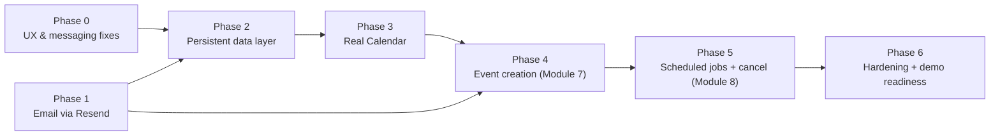

# Implementation Plan — Path to a Full Working Prototype

This is the remaining work, ordered into phases. Each phase is a **vertical
slice**: by the end of it, a specific piece of the product is real end to
end (persisted/sent for real where it matters, wired to the frontend,
tested) — not a backend stub waiting on a frontend, or a frontend waiting on
a real backend. Don't start a phase's frontend work against mocked data if
the phase's backend section is meant to land first; the point of a vertical
slice is that nothing in a "done" phase is secretly still fake.

Read [DATA_MODEL.md](DATA_MODEL.md), [MODULE_GUIDE.md](MODULE_GUIDE.md),
[ARCHITECTURE.md](ARCHITECTURE.md), and
[scheduling/providers/interfaces.py](../backend/app/scheduling/providers/interfaces.py)
before starting Phase 2 — everything from there down builds against those
contracts, it doesn't redesign them.

**Current baseline (do not redo):** auth module (real Google OAuth/RBAC/
sessions), the pure scheduling engine (`backend/app/scheduling/{feasibility,
assignment,reservations,state_machine,escalation,pipeline}.py`, untouched,
still fully covered by its own 57 tests), the full HTTP surface in
`scheduling/router.py`, and every frontend page — all now backed by **real
DB persistence** (`scheduling/service.py` + `app/db/models.py`, Phase 2) with
**real email** (Resend, Phase 1). `CalendarProvider` is still **mocked** -
that's Phase 3. **Phases 0, 1, and 2 are done** (see their sections for
exactly what shipped); Phase 3 onward is still ahead.

**Revision note (this version):** Phase 0 (UI/UX + messaging fixes) and
Phase 1 (email via Resend) are new, added from direct product feedback.
Phase 1 replaces the old "Notification Service" phase and moves it *earlier*
and *off* the Persistent Data Layer dependency — Resend is a plain HTTP API
with its own key, not a Google-token-gated integration, so it doesn't need
Phase 2's DB work to be real. Everything from the old plan's Phase 1 onward
is renumbered but otherwise unchanged in substance.

---

## Phase 0 — Immediate UX & Correctness Fixes ✅ done

**Goal:** fix concrete, already-identified bugs and rough edges across the
three dashboards. Frontend-only except one small backend matching tweak;
none of this depends on or blocks any later phase, so it can land first and
fast.

**Shipped:**
- `pool.py` gained `_type_ok`/`TECHNICAL_ROUND_TYPES` — an interviewer
  qualified for generic `"TECHNICAL"` now matches either round; existing
  granular `TECHNICAL_ROUND_1`/`_2` entries are unaffected (0.2). Covered by
  3 new tests in `test_pool_resolution.py`.
- `FeasibilityResult` gained `candidate_message` (`models.py`), populated
  in `feasibility.py`'s `_empty()` alongside the unchanged, recruiter-only
  `no_match_reason` (0.6). Covered in `test_feasibility.py` and the
  end-to-end API test.
- `InterviewerProfile.jsx`: skills and qualification types are both
  chip/checkbox multi-selects now (`SKILLS` / `INTERVIEWER_QUALIFICATION_TYPES`
  in `lib/constants.js`), no free-text skills field, no Round 1/Round 2
  checkboxes (0.1, 0.2). `RequestNew.jsx` is unchanged — the recruiter still
  picks a specific round.
- `GoogleConnectionCard.jsx`: connect/reconnect/disconnect actions removed
  entirely — status + granted-scopes display only, everywhere it's used
  (dashboard summary + `/settings/google`) (0.3). `GoogleConnection.jsx`'s
  copy updated to match (no more "reconnecting/disconnecting" language).
- `Dashboard.jsx`: the `ROADMAP` workflow-stage flowchart is gone, replaced
  with a live stats row (open requests/upcoming interviews for staff,
  pending offers/confirmed seats for interviewers) and the new
  `ActivityCalendar` widget (0.4, 0.8).
- `Candidate.jsx`: the no-match escalation panel now reads
  `feasibility.candidate_message` instead of the recruiter's
  `no_match_reason`; slot-picker and panel-confirmation copy reworded off
  internal pool-sizing language; `ActivityCalendar` added once booked (0.5,
  0.6, 0.8).
- New shared `components/ActivityCalendar.jsx` (+ `.module.css`) — agenda-list
  widget consumed by both `Dashboard.jsx` and `Candidate.jsx`, built purely
  against existing endpoints (`listRequests`, `myOffers`, `myRequest`), no
  new backend endpoint needed.

Backend: 59/59 tests pass (`backend/.venv/Scripts/python.exe -m pytest -q`).
Frontend: `npm run build` clean.

### 0.1 Skills as a proper multi-select (interviewer dashboard)
`InterviewerProfile.jsx` currently takes skills as a raw comma-separated text
input (`placeholder="python, system-design"`) — same free-text pattern
`RequestNew.jsx` uses for `required_skills` on the recruiter side. Since
matching is an exact-string subset check (`pool.py`), free text on either
side is fragile (`"React"` vs `"react"` vs `"ReactJS"` silently fail to
match). Replace the interviewer-side input with a dropdown/chip multi-select
against a shared, canonical skill list (new `SKILLS` array in
`lib/constants.js`), using the same chip pattern already built for
"Qualified interview types" in the same file.
- *Follow-on, not in scope here:* `RequestNew.jsx`'s skill field should
  eventually move to the same canonical list so recruiter-entered and
  interviewer-declared skills actually line up — flagged for awareness, not
  required to ship this fix.

### 0.2 Interviewer profile must not expose "Round 1 / Round 2" as separate qualifications
Today `INTERVIEW_TYPES` (`lib/constants.js`) includes `TECHNICAL_ROUND_1` and
`TECHNICAL_ROUND_2` as two separate checkboxes an interviewer ticks
independently in `InterviewerProfile.jsx`, and `pool.py` does an exact-string
match (`request.interview_type not in interviewer.interview_types`) — so an
interviewer who only checked Round 1 is silently ineligible for a Round 2
request, which isn't a real qualification distinction, just a round number.
Fix:
- Frontend: collapse the interviewer-facing choice to one **"Technical"**
  qualification chip (drop the two round-specific checkboxes from
  `InterviewerProfile.jsx`), alongside Screening / Managerial / HR.
- Backend: `pool.py`'s eligibility check treats an interviewer qualified for
  `"TECHNICAL"` as eligible for **both** `TECHNICAL_ROUND_1` and
  `TECHNICAL_ROUND_2` requests (normalize on match, not on storage — keep
  the request-side `interview_type` enum as-is, since the recruiter *does*
  need to distinguish which round it is for tracking).
- The recruiter's request-creation form (`RequestNew.jsx`) is unaffected —
  it still picks the specific round.

### 0.3 Remove "Reconnect"/"Disconnect Google" from all three dashboards
`GoogleConnectionCard.jsx`'s `variant="full"` renders both buttons on
`/settings/google`, reached from all three roles' dashboards. Remove the
`actions` block (both the "Reconnect/Connect Google" and "Disconnect"
buttons) and the `handleDisconnect`/`handleConnect` handlers that back them,
across recruiter, interviewer, and candidate views alike — the card should
become a status-only display (connected/not-connected + scopes granted).
Confirm with whoever owns the auth flow whether initial connect (first-time,
`connected === false`) still needs *some* action, or whether that already
happens automatically as part of Google login — if it's automatic, the
whole actions block goes; if not, keep only the very first "Connect Google"
action and drop reconnect/disconnect specifically.

### 0.4 Rebuild the homepage — remove the workflow flowchart, ship a real dashboard
`Dashboard.jsx`'s `ROADMAP` list ("Scheduling workflow" card walking through
all 8 WORKFLOW.md stages with done/coming-soon pills) is internal
implementation status, not a product homepage. Replace that card with actual
dashboard content:
- The new calendar widget (0.8, below).
- Live counts instead of a static roadmap: open requests / pending offers /
  upcoming interviews this week, per role.
- Keep the existing profile card, Google connection summary (now
  status-only per 0.3), and role-specific quick actions
  (`StaffQuickActions`/`InterviewerQuickActions`) — those are already real
  dashboard content, not the part being replaced.

### 0.5 Correct candidate-facing copy (candidate scheduling flow)
`Candidate.jsx`'s messaging currently leaks internal/engine language instead
of speaking to the candidate. Concretely: the `manual_scheduling_required`
panel renders `feasibility.no_match_reason` (line 177) directly — the same
string built for the *recruiter* in `escalation.py`/`feasibility.py` (see
0.6) — plus a pass over the rest of the page's copy ("Pick a time — these
are the slots where enough interviewers are free" exposes pool-sizing
language the candidate has no context for) for tone consistent with a
candidate-facing product rather than an internal scheduling console.

### 0.6 Fix the "no matching time slot" error message
Root cause, found in `feasibility.py`: when no slot clears the bar, the
generated `no_match_reason` is built entirely for a recruiter's eyes —
`"no time in the candidate's submitted availability has >= {N} qualified
interviewer(s) free (eligible pool of {matched}, duration {d}m + buffers
{b1}/{b2}m)"` — and that exact string is what both `RequestDetail.jsx`
(recruiter view, correctly) **and** `Candidate.jsx` (line 177, incorrectly)
display. Fix: give `FeasibilityResult` a second, candidate-safe field (e.g.
`candidate_message`) alongside the existing recruiter-facing
`no_match_reason` — something like "We couldn't find a time that works for
everyone yet — a recruiter has been notified and will follow up." — and have
`Candidate.jsx` render that field instead of `no_match_reason`.
`RequestDetail.jsx` keeps showing the detailed `no_match_reason` unchanged
(that one's correct today).

### 0.7 (backend note) Keep 0.2/0.6 scoped to the engine's pure functions
Both of these touch `backend/app/scheduling/` core modules
(`pool.py`, `feasibility.py`, `models.py`) — add/update the relevant tests in
`tests/scheduling/test_pool_resolution.py` and `test_feasibility.py` in the
same change, since this package's whole design point is 100% test coverage
on pure functions; don't ship a behavior change there without a matching
test.

### 0.8 Calendar view on the dashboard (assigned activities)
Add a calendar widget to the dashboard (all three roles) showing each user's
own upcoming interview activity:
- Recruiter/hiring manager: interviews they created, by confirmed time (or
  still-pending status if not yet scheduled).
- Interviewer: seats they've accepted, by confirmed time.
- Candidate: their own interview, once a slot is confirmed.
- Data source: this can be built entirely against **existing** endpoints
  (`listRequests`, `myOffers`, `myRequest`) aggregated client-side — no new
  backend endpoint is required for this phase. A small `GET
  /scheduling/my-calendar` aggregation endpoint returning one normalized
  event shape across all three roles is a reasonable follow-up once Phase 2
  lands (cheaper than three slightly-different client-side aggregations),
  not a blocker now.
- Keep it simple: a month or agenda-style list view is enough for a
  prototype — this isn't the place to pull in a heavy calendar-grid library
  (check `dataviz`/`artifact-design`-style restraint: a clear list of
  "Tue Sep 9, 3:00 PM — Technical Round 1 with Jane Doe" rows beats a dense
  grid nobody asked for).

**Definition of done:** all three dashboards show status-only Google
connection cards, a real dashboard (no flowchart) with a working calendar
widget, interviewer profile has a skills multi-select and no round-specific
checkboxes, candidates see a candidate-appropriate message in every state
including the no-match case, and `pool.py`/`feasibility.py`'s test suites
cover the new behavior.

---

## Phase 1 — Email Notifications via Resend ✅ done

**Shipped:** `RESEND_API_KEY`/`RESEND_FROM_EMAIL` in `Settings` +
`.env.example` (real key in the gitignored `.env` only — never in a commit or
in chat history beyond the one message it arrived in). New `app/notifications/`
package: `service.py` (`send_email`, `EmailSendError`), `inbox.py` (the
in-app inbox, moved verbatim out of `store.py` to avoid a circular import),
`provider.py` (`ResendNotificationProvider` — composes the inbox for
dual-write, resolves interviewer/recruiter emails via `interviewer_repo`/a
new `request_owner_email` dict, swallows every send failure so a Resend
outage can never turn an engine state transition into a 500). All three
priority sends are live: invite email (`router.py`'s `create_request`),
escalation notice to the recruiter, and booking confirmation to the
candidate (`send_panel_complete`). Seat-offer/filled/released to
interviewers use the same provider, same priority order as planned.
`tests/conftest.py` stubs the one HTTP call for the *entire* suite (the real
key lives in `.env`, so without this every test that triggers a notification
would hit real Resend) — `tests/notifications/` then layers its own
monkeypatching on top to assert exact request/response behavior. 69/69
backend tests pass; verified twice with a real send through the actual
wired code path — first against the shared `onboarding@resend.dev` test
sender (restricted to the Resend account's own address, as expected without
a verified domain), then again after the domain was verified
(`noreply@ujjwalhirwani.me`), confirming delivery to an arbitrary recipient.
`RESEND_FROM_EMAIL` in `.env` now points at the verified domain.

**Goal (context for the above):** the notifications the engine already fires become real emails,
starting with the candidate-facing ones. This does **not** wait on Phase 2 —
`NotificationProvider` is a plain interface the engine already calls through
`store.py`'s wiring today; Resend is a hosted HTTP API with its own API key,
not a Google-token-gated integration, so it slots in immediately.

**Backend**
- `RESEND_API_KEY` and a verified `RESEND_FROM_EMAIL` added to `Settings`
  (`app/core/config.py`) **and** `backend/.env.example` with a comment on
  where to get them (CONVENTIONS.md's secrets rule — never hand-entered only
  in a local `.env`). The user is providing the real key out of band; it
  goes in `.env` only, never committed.
- `app/notifications/service.py`: single `send_email(to, subject, body_html,
  ics_attachment=None)` calling Resend's `POST /emails`, used everywhere
  below instead of reimplementing sending per call site.
- `ResendNotificationProvider(NotificationProvider)` implementing all six
  hooks from `providers/interfaces.py` (`send_seat_offer`,
  `send_seat_filled`, `send_seat_released`, `send_panel_complete`,
  `send_interview_cancelled`, `notify_recruiter_manual_scheduling`) — wire it
  into `store.py`'s provider instantiation in place of
  `InboxNotificationProvider`, **dual-writing** to the in-app inbox too so
  the existing Notifications page keeps working unchanged.
- Priority order matches the ask — get these three actually sending first,
  they're the real gaps today:
  1. **Invite email.** `create_request` currently only *returns*
     `invite_link` in the API response for the recruiter to copy by hand —
     nothing emails it to the candidate. Send it via `send_email` right
     after the `InviteToken` is created.
  2. **Escalation notice** (`notify_recruiter_manual_scheduling`) to the
     recruiter — currently silent (in-memory `ManualEscalation` record only).
  3. **Booking confirmation** (`send_panel_complete`) to the candidate, once
     Phase 0.6's candidate-safe copy exists to reuse in the email body.
  - Seat-offer/seat-filled/seat-released emails to interviewers are in
     scope too (same provider, same six hooks) but are explicitly
     lower-priority than the candidate-facing three above, per the ask.
- **Not required for this phase:** a signed, no-login accept/decline link in
  the email itself. Every recipient already authenticates via Google (the
  existing invite-link/session flow), and interviewers already respond
  through the authenticated `InterviewerOffers` page — a logged-out
  accept/decline link is a nice-to-have deferred to the backlog, not a gap
  in the working prototype.

**Tests:** `send_email` unit test against a fake/stubbed HTTP transport
(capture recipient/subject/body, no real network call in the suite);
provider test asserting each of the six hook methods calls `send_email` with
the right recipients.

**Frontend:** none required — this is purely "things that used to only
happen in-app now also send a real email."

**Definition of done:** creating a request actually emails the candidate an
invite link (not just returns it in the API response); an escalated request
actually emails the recruiter; a fully-booked interview actually emails the
candidate a confirmation.

---

## Phase 2 — Persistent Data Layer ✅ done

**Shipped:** the extended `Interview` table + `InterviewerProfile`,
`CandidateAvailabilityWindow`, `InterviewSlotOffer`, `InterviewParticipant`
(one migration, `cf6bd29ccb47` — hand-adjusted after autogenerate diffed
against dev.db's actual drifted state rather than a clean migration replay,
see the migration file's own docstring). A few deliberate departures from
DATA_MODEL.md's literal columns, documented in `app/db/models.py`'s
`Interview` docstring and DATA_MODEL.md's status note (denormalized
email/name fields instead of `User` joins; `seats_json`/`feasibility_json`
caches for engine state that has no independent DB representation).

Real providers: `DbInterviewerRepository`, `DbCandidateRepository`,
`DbAvailabilityRepository`, `DbInterviewerLoadProvider`, and
`DbReservationLedger` (the last isn't an ABC — see its docstring). All five
live in `app/scheduling/providers/db_*.py`, mirroring the `mock_*.py`
naming the pure engine's own tests still use unchanged. `service.py`'s
`SchedulingService` replaces `store.py` (deleted) with the exact same public
method surface, so `router.py`'s diff is almost entirely "`store` → `svc`."

One real correctness bug found and fixed along the way, worth flagging: the
first version of `DbReservationLedger.reserve()` relied on `with_for_update()`
alone and a confident comment that SQLite's coarser locking would still make
it race-free — a concurrency test
(`tests/scheduling_service/test_reservation_concurrency.py`) proved that
false on the first few runs (both of two concurrent reservations for the
same overlapping slot could win). Root cause: SQLite never blocks a plain
read, so two threads' "is this free?" checks both pass before either writes
- `with_for_update()` only ever matters once a write is issued, too late to
stop that race. Fixed with an explicit process-wide `threading.Lock` per
interviewer id, held across the whole check-then-insert-then-commit sequence
(committing immediately, not at the caller's usual end-of-request commit,
so a second thread that was blocked on the lock sees the first's reservation
the moment it gets its turn) — see the module's docstring for the full
reasoning. 15/15 stress runs clean after the fix.

Verified restart-survival directly (not just asserted): one Python process
created a request and submitted availability, exited completely; a second,
completely separate process opened the same DB file fresh and correctly
read back the same state, then continued the flow (picked a slot, got an
offer created) - Documentation/IMPLEMENTATION_PLAN.md Phase 2's literal DoD.
That same run also hit a real (accidental) Resend rejection - `example.com`
isn't a real recipient domain - and confirmed the "email failures never
propagate" design from Phase 1 holds for a real failure, not just a mocked
one: the seat offer still succeeded.

70/70 backend tests pass (`cd backend && pytest`).

**Goal (context for the above):** the app survives a restart. Everything currently living in
`store.py`'s process memory moves into real tables, with the same request/
response contracts the frontend already calls — this phase should be
invisible to a user clicking through the app, and provable by restarting the
backend mid-flow and continuing where you left off.

**Backend**
- One Alembic migration (per [DATA_MODEL.md](DATA_MODEL.md#migrations),
  autogenerated then reviewed) extending `Interview` and adding
  `InterviewerProfile`, `CandidateAvailabilityWindow`, `InterviewSlotOffer`,
  `InterviewParticipant` — exactly the spec in DATA_MODEL.md, don't invent
  new shapes.
- Implement the real providers against `providers/interfaces.py`'s ABCs,
  backed by these tables: `DbInterviewerRepository`, `DbAvailabilityRepository`,
  `DbCandidateRepository`, `DbInterviewerLoadProvider` (the two live-computed
  queries in DATA_MODEL.md — `current_load` / `last_assigned_at` — never a
  stored counter).
- New service layer (e.g. `app/scheduling/service.py`) that does what
  `store.py` does today, but as real DB transactions — including the
  `SELECT ... FOR UPDATE` lock on `InterviewerProfile` at offer-creation time
  (DATA_MODEL.md's "assignment transaction"), which is the one piece
  `store.py`'s in-memory version couldn't honestly prove.
- Repoint `scheduling/router.py` from `get_store()` to the new DB-backed
  service. `CalendarProvider` stays mocked for now — that's Phase 3, not this
  one. `NotificationProvider` is **already real** by this point (Phase 1's
  `ResendNotificationProvider`) — reuse that same instance against the new
  DB-backed service, don't rewrite it.
- Retire `store.py` and its in-memory-only providers once the router no
  longer imports them.

**Tests**
- Repository-level tests (SQLite test DB) for each new provider, mirroring
  the assertions `tests/scheduling/` already makes against the mocks.
- Port `tests/scheduling_api/test_end_to_end.py` to run against the DB
  service instead of the in-memory store — same scenarios, different backing
  store.
- A concurrency test for the offer-creation lock: two threads/tasks racing to
  offer the same interviewer overlapping times — second one must lose
  cleanly, not double-book.

**Frontend:** no changes — contracts are unchanged. Manual check: run the
full 8-stage flow, restart `uvicorn`, confirm `GET /scheduling/requests/{id}`
still returns the same state.

**Definition of done:** `alembic upgrade head` runs clean from empty DB; all
of Phase 2's + the existing 56 tests pass; a mid-flow backend restart loses
nothing.

---

## Phase 3 — Real Google Calendar Integration

**Goal:** feasibility and ranking check interviewers' *actual* Google
Calendars, not a mock.

**Backend**
- `GoogleCalendarProvider(CalendarProvider)` calling `freebusy.query` via
  `google_oauth.get_valid_access_token(db, user_id)` — never a token handled
  outside the auth module (see ARCHITECTURE.md's one hard rule).
- `ReauthRequired` from a dead connection must not make that interviewer
  silently vanish from every slot — surface it explicitly (MODULE_GUIDE.md's
  Module 4 edge case) so it reads as "needs to reconnect," not "not
  qualified." Note: Phase 0.3 removed the manual reconnect/disconnect
  buttons from the dashboards, so this surfacing needs its own affordance
  (e.g. a banner linking to `/settings/google`, where the "Connect Google"
  action still lives) rather than assuming the old card's "Reconnect" button
  is still there to point at.
- Wire this provider in for both Module 4 (feasibility) and Module 6
  (re-check at fixed time) — same call, both places, per WORKFLOW.md.

**Tests**
- Fake/recorded HTTP transport (`httplib2`'s mock transport or a recorded
  fixture) so tests never hit real Google — the existing mock provider stays
  in the test suite as the fast-path default; this is an additional
  integration-level test, not a replacement of the unit tests.
- One documented manual smoke test procedure using two real connected Google
  accounts (put it in this doc's own "Manual verification" section once
  written, not left as tribal knowledge).

**Frontend**
- Surface the reconnect-needed state per the note above.

**Definition of done:** creating a request against a pool of real,
Calendar-connected interviewers correctly excludes genuinely busy times,
demoed with real accounts, not fixtures.

---

## Phase 4 — Module 7: Event Creation & Dispatch

**Goal:** once all N seats are `ACCEPTED`, a real Google Calendar event with
a Meet link actually gets created, and everyone gets a confirmation with an
`.ics` fallback.

**Backend**
- `events.insert` with `conferenceData: {createRequest: {...}}` and
  `conferenceDataVersion=1`, attendees = candidate + hiring manager (if any)
  + all N confirmed interviewers, organized via the recruiter's
  `get_valid_access_token`.
- Store `calendar_event_id` / `meeting_link` on `Interview`; check
  `calendar_event_id` is unset before creating, so a retry after a partial
  failure doesn't double-book (MODULE_GUIDE.md's Module 7 edge case).
- `.ics` generation (e.g. the `icalendar` package) attached via Phase 1's
  `send_email` (Resend supports attachments directly).

**Tests:** idempotency test (call the finalize step twice, assert one event),
fixture/recorded-transport test for the `events.insert` payload shape.

**Frontend**
- `RequestDetail.jsx` currently has no meeting-link section — add one: once
  `interview.status` reflects all seats confirmed, show the Meet link and
  confirmed time prominently (this is the actual "it's booked" moment users
  are looking for on that page today). Feed the same confirmed event into
  Phase 0.8's calendar widget.

**Definition of done:** full happy path — create request → candidate
availability → feasibility → slot pick → N-seat assignment → a real Calendar
event with a working Meet link appears on every attendee's real calendar,
confirmation email received with `.ics` attached.

---

## Phase 5 — Module 8: Scheduled Jobs + Cancel/Reschedule Against the Real Calendar

**Goal:** the parts of Stage 8 that need a clock (reminders, offer-expiry
cascade) and the parts that need to undo a real booking (cancel/reschedule)
both work without a human watching.

**Backend**
- A scheduled job (APScheduler is enough at this scale, per
  MODULE_GUIDE.md) running two sweeps: (a) `InterviewSlotOffer` rows past
  `expires_at` → trigger the same per-seat cascade a decline would, (b)
  interviews starting within the reminder window → send a reminder via
  Phase 1's service.
- `POST /interviews/{id}/cancel`, `/reschedule`, `/interviews/{id}/interviewer-cancel`
  (already present in `router.py` against the in-memory store from before
  Phase 2) — repoint to the Phase 2 DB service, and extend to actually touch
  the real event: `events.patch` to drop one attendee on a single-seat
  interviewer-cancel, `events.delete` (or patch to cancelled) on a full
  candidate cancel.
- Guard: reject a cancel/reschedule against an interview whose
  `confirmed_start_utc` has already passed (MODULE_GUIDE.md's Module 8 edge
  case).

**Tests:** sweep-triggers-cascade test with a manufactured expired offer,
cancel test asserting the real (fixture) Calendar call fires with the right
attendee removed vs. full delete.

**Frontend**
- Add the recruiter-facing cancel/reschedule action to `RequestDetail.jsx`
  (not present yet) and the interviewer-facing cancel action to
  `InterviewerOffers.jsx` if it isn't already wired past the accept/decline
  step — check before assuming either needs it.

**Definition of done:** an unanswered offer past its timeout cascades to the
next candidate with zero manual intervention; a cancelled interview's real
Calendar event is actually gone/updated for every real attendee.

---

## Phase 6 — Hardening, Concurrency & Demo Readiness

**Goal:** the prototype survives the questions evaluators will actually
try, and the docs stop lying about what's built.

- Concurrency: validate the Phase 2 row-lock under real parallel load (two
  interviews' cascades independently targeting the same top-ranked person),
  and confirm the "what breaks first" story in ARCHITECTURE.md still holds.
  Postgres switch is a config change (`DATABASE_URL`), not new code — verify
  it actually works, don't just assert it.
- CONVENTIONS.md pass over every endpoint added since Phase 2: empty/missing
  fields, double-submit idempotency, RBAC on each new route, no secret ever
  logged (including `RESEND_API_KEY`).
- Update the stale docs: `Documentation/README.md`'s status table (currently
  shows everything past auth as 🔲, which stopped being true several commits
  ago), `DATA_MODEL.md`'s "Status" note once the tables are real,
  `ARCHITECTURE.md`'s notification-service line (now decided: Resend, see
  Phase 1).
- A seed script (`backend/scripts/seed_demo.py`) creating a small
  interviewer pool + one ready-to-walk-through interview request, so a live
  demo doesn't start from an empty DB.
- Run the `security-review` skill over the full diff before the final demo
  build.
- Final regression: full backend test suite green, plus a manual
  click-through checklist covering all 8 stages including at least one
  decline-cascade and one cancellation.

**Definition of done:** a fresh clone, `alembic upgrade head`, the seed
script, and a click-through of all 8 stages — including a forced decline
cascade and a cancellation — works without touching a debugger, and every
doc in `Documentation/` matches what's actually in the code.

---

## Sequencing

Phase 0 and Phase 1 (email) have no dependency on each other or on anything
below them — do both first, in either order or in parallel. Phase 2 is a
hard prerequisite for everything from Phase 3 onward — no phase past this
point should be built against the in-memory store. Phases 3 (Calendar) is
independent of Phase 1 (email, already done) and can run right after Phase 2.
Phase 4 needs both Phase 1 (confirmation email) and Phase 3 (real feasibility
feeding a real booking). Phase 5 needs Phase 4 (there's no real event to
cancel/reschedule before then). Phase 6 is last, always.

