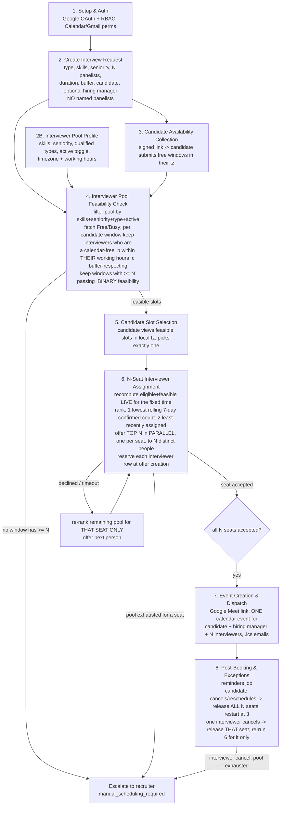

# Smart Interview Scheduler — Workflow (source of truth)

This is the maintained description of the end-to-end flow. The scheduling **core**
(steps 4, 5-validation, 6, and the step-8 re-computations) lives in
`src/hacksmiths/scheduler/`; see [`../SCHEDULER.md`](../SCHEDULER.md) for its
internals. Steps 1-3, 5-UI, 7, and the reminder job are owned by other parts of
the project.

## Stage-by-stage

| # | Stage | Owner | Notes / decisions |
|---|---|---|---|
| 1 | Setup & Auth | teammate | **Google OAuth only** (RBAC by role). No email/password, no SSO alternative — a consciously accepted narrowing of the brief. Calendar + Gmail scopes collected here. |
| 2 | Create Interview Request | teammate UI → core models | Recruiter defines `interview_type`, `required_skills`, `seniority`, `panelists_required` (N), duration + buffer (on `Round`), candidate email + timezone. **No named panelists** — all N seats auto-filled in step 6. A **hiring manager** may be named explicitly (`hiring_manager_email`); they are added to the event but **not pooled or availability-checked**. |
| 2B | Interviewer Pool Profile | teammate | Each interviewer declares skills, seniority, qualified interview types, an **active/inactive** toggle, and timezone + working hours (default 09:00-18:00 in their own tz). Feeds `InterviewerRepository`. |
| 3 | Candidate Availability Collection | teammate | Unique signed link; candidate logs in and submits free time windows **in their own timezone**. Persisted as UTC `AvailabilityWindow`s via `AvailabilityRepository`. **This replaces the old recruiter "scheduling window" entirely** — the candidate's windows are the only time bound. |
| 4 | Interviewer Pool Feasibility Check | **core** — `pool.py` + `feasibility.py` | `resolve_interviewer_pool` filters the directory by active + interview type + skill (default: all required) + seniority (default: at-least). Then for each start time inside each candidate window, count interviewers who are individually (a) calendar-free, (b) inside **their own** working hours, (c) buffer-respecting. Keep the slot if `>= N`. **Binary** — no ranking here. Nothing feasible → escalate. |
| 5 | Candidate Slot Selection | teammate UI + **core validation** | Candidate picks exactly one feasible slot. The core (`assign_panel`) validates the chosen id is in the feasible set before proceeding. |
| 6 | N-Seat Interviewer Assignment | **core** — `assignment.py` (`PanelAssignmentAgent`, fully deterministic, no LLM) | Recompute who is still feasible **live** at the fixed time (same 3 checks + reservation ledger). Rank by `(rolling 7-day confirmed count ASC, last-assigned ASC, id)`. Offer the top N seats **in parallel**, one per seat, to N distinct people; **reserve each interviewer's row at the moment the offer is created** (interval-overlap lock, so nobody is double-booked across two interviews). Per seat: accepted → filled; declined / offer timeout → release, re-rank the remainder **for that seat only**, offer next; pool exhausted for a seat → escalate. All N accepted → `panel_complete`. |
| 7 | Event Creation & Dispatch | teammate | Meet link via `conferenceData` on `events.insert`; one calendar event for candidate + hiring manager + N interviewers; confirmation emails with `.ics`. The core exposes `verify_ready_to_finalize` (final conflict re-check) as the hand-off gate. |
| 8 | Post-Booking & Exception Handling | teammate job + **core** — `state_machine.py` | Reminder cron (teammate). **Candidate cancel/reschedule** (`candidate_cancel` / `candidate_reschedule`): release ALL N seats + reservations, notify, reset the request to `collecting_availability` and restart at step 3. **One interviewer cancels after accepting** (`interviewer_cancel`): release just that seat, re-run step 6's cascade for that seat only at the same fixed time excluding them; the candidate's time and the other seats are untouched unless that seat's pool is exhausted (→ escalate). |

## Mapping to the hackathon minimum deliverables

| Deliverable | Where |
|---|---|
| Interface for creating an interview request | step 2 (teammate) + `InterviewRequest` model |
| Calendar availability checks for all required internal participants | step 4 — `feasibility.py`, per-interviewer free/busy + own working hours + buffer |
| Candidate availability collection | step 3 (teammate) + `CandidateAvailability` / `AvailabilityRepository` |
| Automated slot recommendation and booking | steps 4-6 — feasible slots (4), candidate pick (5), deterministic N-seat fill (6) |
| Calendar event creation with interview details | step 7 (teammate); core gates it with `verify_ready_to_finalize` |
| Automated candidate and interviewer communications | `NotificationProvider` hooks (seat offer / filled / released / panel complete / cancelled / recruiter escalation); email/SMS bodies are teammate-owned |
| Conflict detection and rescheduling support | `ReservationLedger` (reserve-at-offer, interval overlap) + `state_machine.py` reschedule / interviewer-cancel paths |
| *Bonus:* intelligent interviewer selection | step 6 ranking (load balancing + round-robin) |
| *Bonus:* time-zone-aware scheduling | every check converts through the owner's IANA timezone |
| *Bonus:* configurable buffer between interviews | `Round.buffer_minutes_before/after`, applied to busy checks and reservations |

## Consciously accepted gaps (this version)

- The recruiter's and the named hiring manager's own calendars are **not** checked
  against the chosen time — only the interviewer pool is.
- **Single auth method** (Google OAuth), despite the brief mentioning multiple.
- `WorkingHours` is time-of-day only — **no weekday map**, so weekends aren't
  excluded by the engine.
- No sequence diagrams, audit/analytics dashboard, SMS, or Zoom.
- No automatic window expansion / buffer relaxation — escalation is terminal for
  the automated pipeline; any retry is an explicit recruiter action.
- No LLM anywhere in the pipeline — interviewer selection is deterministic ranking.
