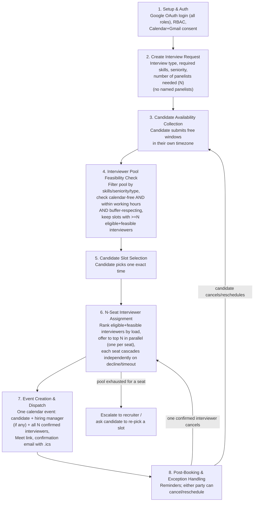

# End-to-End Workflow

This is the agreed shape of the product — the contract every module is built
against. This is the maintained, fully-explained version;
[`workflow.txt`](../workflow.txt) (repo root) mirrors the same stages as a
quick-glance ASCII diagram — if the two ever disagree, this file is right and
`workflow.txt` needs updating to match.

**Where the code lives:** stages 4, 6, and the step-8 re-computations have a
dedicated, tested scheduling core at
[`backend/app/scheduling/`](../backend/app/scheduling/) — pure Python,
provider-interface-based, no direct Calendar/DB calls of its own. See
[SCHEDULER.md](SCHEDULER.md) for its internal design (the feasibility/ranking
split, the seniority-matching rule, working-hours precedence,
reservation-at-offer locking, the per-seat cascade). Everything else below —
auth, the request/profile/availability UIs, event creation, notifications,
the reminder job — is owned directly by the FastAPI modules described in
[MODULE_GUIDE.md](MODULE_GUIDE.md).

**Revision history (interviewer pooling), so nobody's confused reading old
context:**
1. Recruiter names specific panelists at creation time. *(original plan)*
2. Recruiter specifies requirements only; system broadcasts to a matching
   pool, first-to-accept wins. *(superseded — reintroduced an N-way accept
   race we didn't need)*
3. Recruiter specifies requirements + panelist **count**; system
   deterministically ranks the eligible pool by load and offers to exactly
   one, sequentially, cascading on decline. *(superseded — only supported
   exactly one interviewer per round)*
4. **Current**: recruiter specifies requirements + panelist count **N**;
   system ranks the eligible-and-free pool (now also checking each
   interviewer's configured working hours, not just raw calendar free/busy)
   and offers to the **top N in parallel** — one offer per seat, each
   independently cascading to the next-ranked candidate on decline/timeout.
   This is the version below.

## What's finalized vs. what's still open

| Decided | Still open (tracked, not forgotten) |
|---|---|
| Google OAuth only, for every role — accepted trade-off against the brief's "must support multiple auth options" line | Recruiter's and the named hiring manager's own calendars are still **not** checked against the chosen time — only the interviewer pool is. Real gap against the literal Challenge text ("checks the calendars of the talent acquisition team, recruiting manager, and required interview panelists"). |
| N interviewers per interview, recruiter-specified, filled via ranked parallel assignment | Proper actor/API-lifeline sequence diagrams (we have a stage flowchart, not a UML-style sequence diagram — still owed as a submission deliverable). |
| Working hours (per-interviewer, timezone-aware) now factored into feasibility, not just raw calendar free/busy | Audit/analytics dashboard, SMS integration, Zoom integration, and genuine LLM-based "AI" usage — all unaddressed bonus items. |

## Stage-by-stage

### 1. Setup & Auth — ✅ built, unchanged
**Owner:** teammate (auth module). Google OAuth for every role (candidate,
recruiter, hiring_manager, interviewer) — see [AUTH_MODULE.md](AUTH_MODULE.md).
Finalized as the only auth method; not revisiting multi-auth support for this
build.

### 2. Create Interview Request
**Owner:** teammate (API + UI). Recruiter defines: candidate email +
timezone, interview type, required skills, required seniority, **number of
panelists needed (N)**, duration, buffer. No panelist is named — the pool
fills all N seats automatically in Stage 6. A hiring manager, if the round
needs one, is still named explicitly — pooling applies only to the
interviewer/panelist role.

### 2B. Interviewer Pool Profile
**Owner:** teammate (API + UI). Every interviewer maintains: skills,
seniority, qualified interview types, active/inactive toggle, **plus their
timezone and working hours** (`working_hours_start`/`working_hours_end`,
defaulting to 09:00–18:00 in their own timezone if never customized). The
working-hours fields are new in this revision — without them, "check their
calendar" only tells you they have no meeting booked, not that the time is
reasonable for them. This feeds the scheduling core's `InterviewerRepository`
adapter directly.

### 3. Candidate Availability Collection
**Owner:** teammate (API + UI). Unchanged: candidate submits free windows in
their own timezone via their invite link, before pool matching runs. Feeds
the scheduling core's `AvailabilityRepository` adapter.

### 4. Interviewer Pool Feasibility Check
**Owner:** scheduling core — `pool.py` + `feasibility.py`. Filter the pool by
skills/seniority/type/active, then for each candidate window, check every
eligible interviewer against **three** conditions, all of which must hold:
1. Calendar free/busy shows them free
2. The time falls inside their configured working hours (converted through
   *their* timezone — never assume a shared timezone across the pool)
3. It respects `buffer_minutes` around their adjacent calendar events

A candidate window is feasible only if **at least N** interviewers pass all
three checks — since Stage 6 needs to fill N seats, not just one. Feasibility
here is deliberately **binary** — no scoring or ranking happens until Stage 6,
once a single time is fixed.

**Decision carried over:** if no window has enough coverage, surface that
explicitly (which constraint is the blocker: too few qualified people, or
everyone's just busy/outside hours) rather than a silent empty result.

### 5. Candidate Slot Selection
**Owner:** teammate (UI) + scheduling core (validation). Unchanged: candidate
picks one exact time from the feasible list; the core validates the chosen
id is still in the feasible set before Stage 6 proceeds.

### 6. N-Seat Interviewer Assignment
**Owner:** scheduling core — `assignment.py` (`PanelAssignmentAgent`, fully
deterministic, no LLM anywhere). Once the candidate confirms a time:

1. Recompute the eligible-and-feasible set live (calendar + working hours +
   buffer, same three checks as Stage 4, re-checked in case anything changed).
2. **Rank** them: lowest rolling 7-day confirmed-interview count first
   (burnout prevention / load balancing), least-recently-assigned as tiebreak
   — both computed live from confirmed assignment history, never a stored
   counter.
3. **Offer to the top N in parallel** — one offer per seat, to N distinct
   people by construction (same ranked list, so no overlap to resolve
   between seats). This is the deliberate middle ground between two worse
   options: broadcasting to the *entire* eligible pool (wasteful, and turns
   into a race unrelated to fairness) versus filling seats one at a time in
   strict sequence (correct, but slower than it needs to be when the top N
   people would all just say yes).
4. Each of the N offers is tracked independently
   (`OFFERED → ACCEPTED / DECLINED / EXPIRED`). A decline or timeout on
   **one** seat cascades only that seat to the next untried candidate in the
   ranking — the other seats, once confirmed, are untouched.
5. Continues until all N seats are `ACCEPTED`, or the ranked list is
   exhausted for an open seat — which escalates to the recruiter (widen
   criteria, manually assign, or ask the candidate to pick a different slot).

**Concurrency guarantee:** because offers are always exactly 1:1 with open
seats (never more offers out than seats needed), there's no multi-way race
*within* one interview. The one race that's still real: two *different*
interviews independently trying to offer the same top-ranked person
overlapping times, moments apart — guarded by the scheduling core's
reservation ledger (`reservations.py`), which locks that interviewer's
buffered time interval at the moment any offer (initial or cascade) is
created. See [DATA_MODEL.md](DATA_MODEL.md#interviewslotoffer-new--module-6).

### 7. Event Creation & Dispatch
**Owner:** teammate. Once all N seats are confirmed: create **one** calendar
event (Meet link via `conferenceData`) with candidate + hiring manager (if
any) + all N confirmed interviewers as attendees. Confirmation email with
`.ics` fallback to everyone. The scheduling core exposes
`verify_ready_to_finalize` as the final conflict re-check gating this step.

### 8. Post-Booking & Exception Handling
**Owner:** teammate (reminder job) + scheduling core (`state_machine.py`) for
the cancel/reschedule logic itself. Reminders before the interview.
Cancellation/reschedule, both parties:

- **Candidate cancels or requests a reschedule:** all N confirmed seats are
  released (notified it's off), flow restarts from Stage 3 with new/updated
  candidate availability.
- **Any one confirmed interviewer cancels:** only their single seat is
  released. The system re-runs Stage 6's ranking/cascade for **that one
  seat**, at the same fixed time, excluding whoever just backed out. The
  candidate's confirmed time and the other N−1 confirmed interviewers are
  untouched unless the pool's exhausted for that seat, which escalates the
  same way Stage 6's exhausted-pool case does.

## Deliverable mapping

| Workflow stage | Hackathon minimum deliverable |
|---|---|
| 1 | (prerequisite for all of them) |
| 2, 2B | #1 Interface for creating an interview request |
| 4 | #2 Calendar availability checks — pool only; recruiter/hiring-manager calendars still not checked, see "still open" above |
| 3, 5 | #3 Candidate availability collection |
| 4, 5, 6 | #4 Automated slot recommendation and booking — the load-balanced N-seat ranking also covers the **bonus** feature "intelligent interviewer selection based on skills or interview type" as core design |
| 7 | #5 Calendar event creation, #6 Automated communications |
| 6, 8 | #6 Automated communications (offer/reminder/cancellation notices), #7 Conflict detection & rescheduling |

Bonus features intentionally folded into core design: candidate self-service
booking (Stage 5), configurable buffer time (Stage 4), timezone-aware
scheduling for both candidate and interviewer (Stages 3, 4, 6), and
skill/seniority-based intelligent interviewer selection with load balancing
(Stages 2B, 4, 6).
