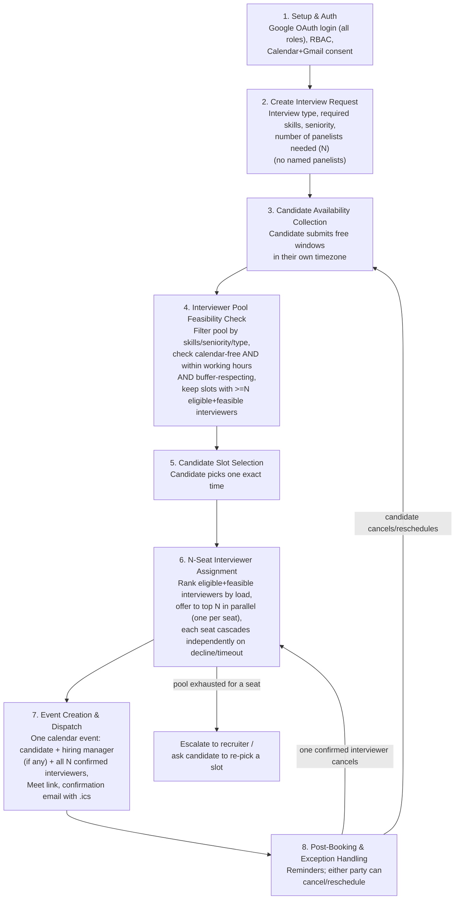
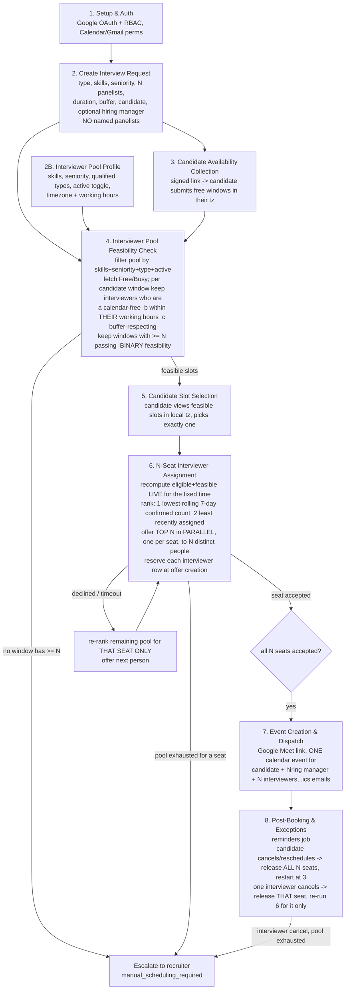

<<<<<<< HEAD
# End-to-End Workflow

This is the agreed shape of the product — the contract every module is built
against. This is the maintained, fully-explained version;
[`workflow.txt`](../workflow.txt) (repo root) mirrors the same stages as a
quick-glance ASCII diagram — if the two ever disagree, this file is right and
`workflow.txt` needs updating to match.

**Revision history (interviewer pooling), so nobody's confused reading old
context:**
1. Recruiter names specific panelists at creation time. *(original plan)*
2. Recruiter specifies requirements only; system broadcasts to a matching
   pool, first-to-accept wins. *(superseded — reintroduced an N-way accept
   race we didn't need)*
3. Recruiter specifies requirements + panelist **count**; system
   deterministically ranks the eligible pool by load and offers to exactly
   one, sequentially, cascading on decline. *(superseded — only supported
   exactly one interviewer per round)*
4. **Current**: recruiter specifies requirements + panelist count **N**;
   system ranks the eligible-and-free pool (now also checking each
   interviewer's configured working hours, not just raw calendar free/busy)
   and offers to the **top N in parallel** — one offer per seat, each
   independently cascading to the next-ranked candidate on decline/timeout.
   This is the version below.

## What's finalized vs. what's still open

| Decided | Still open (tracked, not forgotten) |
|---|---|
| Google OAuth only, for every role — accepted trade-off against the brief's "must support multiple auth options" line | Recruiter's and the named hiring manager's own calendars are still **not** checked against the chosen time — only the interviewer pool is. Real gap against the literal Challenge text ("checks the calendars of the talent acquisition team, recruiting manager, and required interview panelists"). |
| N interviewers per interview, recruiter-specified, filled via ranked parallel assignment | Proper actor/API-lifeline sequence diagrams (we have a stage flowchart, not a UML-style sequence diagram — still owed as a submission deliverable). |
| Working hours (per-interviewer, timezone-aware) now factored into feasibility, not just raw calendar free/busy | Audit/analytics dashboard, SMS integration, Zoom integration, and genuine LLM-based "AI" usage — all unaddressed bonus items. |

## Stage-by-stage

### 1. Setup & Auth — ✅ built, unchanged
Google OAuth for every role (candidate, recruiter, hiring_manager,
interviewer) — see [AUTH_MODULE.md](AUTH_MODULE.md). Finalized as the only
auth method; not revisiting multi-auth support for this build.

### 2. Create Interview Request
Recruiter defines: candidate email + timezone, interview type, required
skills, required seniority, **number of panelists needed (N)**, duration,
buffer. No panelist is named — the pool fills all N seats automatically in
Stage 6. A hiring manager, if the round needs one, is still named explicitly
— pooling applies only to the interviewer/panelist role.

### 2B. Interviewer Pool Profile
Every interviewer maintains: skills, seniority, qualified interview types,
active/inactive toggle, **plus their timezone and working hours**
(`working_hours_start`/`working_hours_end`, defaulting to 09:00–18:00 in
their own timezone if never customized). The working-hours fields are new in
this revision — without them, "check their calendar" only tells you they
have no meeting booked, not that the time is reasonable for them.

### 3. Candidate Availability Collection
Unchanged: candidate submits free windows in their own timezone via their
invite link, before pool matching runs.

### 4. Interviewer Pool Feasibility Check
Filter the pool by skills/seniority/type/active, then for each candidate
window, check every eligible interviewer against **three** conditions, all
of which must hold:
1. Calendar free/busy shows them free
2. The time falls inside their configured working hours (converted through
   *their* timezone — never assume a shared timezone across the pool)
3. It respects `buffer_minutes` around their adjacent calendar events

A candidate window is feasible only if **at least N** interviewers pass all
three checks — since Stage 6 needs to fill N seats, not just one.

**Decision carried over:** if no window has enough coverage, surface that
explicitly (which constraint is the blocker: too few qualified people, or
everyone's just busy/outside hours) rather than a silent empty result.

### 5. Candidate Slot Selection
Unchanged: candidate picks one exact time from the feasible list.

### 6. N-Seat Interviewer Assignment
Once the candidate confirms a time:

1. Recompute the eligible-and-feasible set live (calendar + working hours +
   buffer, same three checks as Stage 4, re-checked in case anything changed).
2. **Rank** them: lowest rolling 7-day confirmed-interview count first
   (burnout prevention / load balancing), least-recently-assigned as tiebreak
   — both computed live from confirmed assignment history, never a stored
   counter.
3. **Offer to the top N in parallel** — one offer per seat, to N distinct
   people by construction (same ranked list, so no overlap to resolve
   between seats). This is the deliberate middle ground between two worse
   options: broadcasting to the *entire* eligible pool (wasteful, and turns
   into a race unrelated to fairness) versus filling seats one at a time in
   strict sequence (correct, but slower than it needs to be when the top N
   people would all just say yes).
4. Each of the N offers is tracked independently
   (`OFFERED → ACCEPTED / DECLINED / EXPIRED`). A decline or timeout on
   **one** seat cascades only that seat to the next untried candidate in the
   ranking — the other seats, once confirmed, are untouched.
5. Continues until all N seats are `ACCEPTED`, or the ranked list is
   exhausted for an open seat — which escalates to the recruiter (widen
   criteria, manually assign, or ask the candidate to pick a different slot).

**Concurrency guarantee:** because offers are always exactly 1:1 with open
seats (never more offers out than seats needed), there's no multi-way race
*within* one interview. The one race that's still real: two *different*
interviews independently trying to offer the same top-ranked person
overlapping times, moments apart — guarded by locking that interviewer's
profile row at the moment any offer (initial or cascade) is created. See
[DATA_MODEL.md](DATA_MODEL.md#interviewslotoffer-new--module-6).

### 7. Event Creation & Dispatch
Once all N seats are confirmed: create **one** calendar event (Meet link via
`conferenceData`) with candidate + hiring manager (if any) + all N confirmed
interviewers as attendees. Confirmation email with `.ics` fallback to everyone.

### 8. Post-Booking & Exception Handling
Reminders before the interview. Cancellation/reschedule, both parties:

- **Candidate cancels or requests a reschedule:** all N confirmed seats are
  released (notified it's off), flow restarts from Stage 3 with new/updated
  candidate availability.
- **Any one confirmed interviewer cancels:** only their single seat is
  released. The system re-runs Stage 6's ranking/cascade for **that one
  seat**, at the same fixed time, excluding whoever just backed out. The
  candidate's confirmed time and the other N−1 confirmed interviewers are
  untouched unless the pool's exhausted for that seat, which escalates the
  same way Stage 6's exhausted-pool case does.

## Deliverable mapping

| Workflow stage | Hackathon minimum deliverable |
|---|---|
| 1 | (prerequisite for all of them) |
| 2, 2B | #1 Interface for creating an interview request |
| 4 | #2 Calendar availability checks — pool only; recruiter/hiring-manager calendars still not checked, see "still open" above |
| 3, 5 | #3 Candidate availability collection |
| 4, 5, 6 | #4 Automated slot recommendation and booking — the load-balanced N-seat ranking also covers the **bonus** feature "intelligent interviewer selection based on skills or interview type" as core design |
| 7 | #5 Calendar event creation, #6 Automated communications |
| 6, 8 | #6 Automated communications (offer/reminder/cancellation notices), #7 Conflict detection & rescheduling |

Bonus features intentionally folded into core design: candidate self-service
booking (Stage 5), configurable buffer time (Stage 4), timezone-aware
scheduling for both candidate and interviewer (Stages 3, 4, 6), and
skill/seniority-based intelligent interviewer selection with load balancing
(Stages 2B, 4, 6).
=======
# Smart Interview Scheduler — Workflow (source of truth)

This is the maintained description of the end-to-end flow. The scheduling **core**
(steps 4, 5-validation, 6, and the step-8 re-computations) lives in
`src/hacksmiths/scheduler/`; see [`../SCHEDULER.md`](../SCHEDULER.md) for its
internals. Steps 1-3, 5-UI, 7, and the reminder job are owned by other parts of
the project.

## Stage-by-stage

| # | Stage | Owner | Notes / decisions |
|---|---|---|---|
| 1 | Setup & Auth | teammate | **Google OAuth only** (RBAC by role). No email/password, no SSO alternative — a consciously accepted narrowing of the brief. Calendar + Gmail scopes collected here. |
| 2 | Create Interview Request | teammate UI → core models | Recruiter defines `interview_type`, `required_skills`, `seniority`, `panelists_required` (N), duration + buffer (on `Round`), candidate email + timezone. **No named panelists** — all N seats auto-filled in step 6. A **hiring manager** may be named explicitly (`hiring_manager_email`); they are added to the event but **not pooled or availability-checked**. |
| 2B | Interviewer Pool Profile | teammate | Each interviewer declares skills, seniority, qualified interview types, an **active/inactive** toggle, and timezone + working hours (default 09:00-18:00 in their own tz). Feeds `InterviewerRepository`. |
| 3 | Candidate Availability Collection | teammate | Unique signed link; candidate logs in and submits free time windows **in their own timezone**. Persisted as UTC `AvailabilityWindow`s via `AvailabilityRepository`. **This replaces the old recruiter "scheduling window" entirely** — the candidate's windows are the only time bound. |
| 4 | Interviewer Pool Feasibility Check | **core** — `pool.py` + `feasibility.py` | `resolve_interviewer_pool` filters the directory by active + interview type + skill (default: all required) + seniority (default: at-least). Then for each start time inside each candidate window, count interviewers who are individually (a) calendar-free, (b) inside **their own** working hours, (c) buffer-respecting. Keep the slot if `>= N`. **Binary** — no ranking here. Nothing feasible → escalate. |
| 5 | Candidate Slot Selection | teammate UI + **core validation** | Candidate picks exactly one feasible slot. The core (`assign_panel`) validates the chosen id is in the feasible set before proceeding. |
| 6 | N-Seat Interviewer Assignment | **core** — `assignment.py` (`PanelAssignmentAgent`, fully deterministic, no LLM) | Recompute who is still feasible **live** at the fixed time (same 3 checks + reservation ledger). Rank by `(rolling 7-day confirmed count ASC, last-assigned ASC, id)`. Offer the top N seats **in parallel**, one per seat, to N distinct people; **reserve each interviewer's row at the moment the offer is created** (interval-overlap lock, so nobody is double-booked across two interviews). Per seat: accepted → filled; declined / offer timeout → release, re-rank the remainder **for that seat only**, offer next; pool exhausted for a seat → escalate. All N accepted → `panel_complete`. |
| 7 | Event Creation & Dispatch | teammate | Meet link via `conferenceData` on `events.insert`; one calendar event for candidate + hiring manager + N interviewers; confirmation emails with `.ics`. The core exposes `verify_ready_to_finalize` (final conflict re-check) as the hand-off gate. |
| 8 | Post-Booking & Exception Handling | teammate job + **core** — `state_machine.py` | Reminder cron (teammate). **Candidate cancel/reschedule** (`candidate_cancel` / `candidate_reschedule`): release ALL N seats + reservations, notify, reset the request to `collecting_availability` and restart at step 3. **One interviewer cancels after accepting** (`interviewer_cancel`): release just that seat, re-run step 6's cascade for that seat only at the same fixed time excluding them; the candidate's time and the other seats are untouched unless that seat's pool is exhausted (→ escalate). |

## Mapping to the hackathon minimum deliverables

| Deliverable | Where |
|---|---|
| Interface for creating an interview request | step 2 (teammate) + `InterviewRequest` model |
| Calendar availability checks for all required internal participants | step 4 — `feasibility.py`, per-interviewer free/busy + own working hours + buffer |
| Candidate availability collection | step 3 (teammate) + `CandidateAvailability` / `AvailabilityRepository` |
| Automated slot recommendation and booking | steps 4-6 — feasible slots (4), candidate pick (5), deterministic N-seat fill (6) |
| Calendar event creation with interview details | step 7 (teammate); core gates it with `verify_ready_to_finalize` |
| Automated candidate and interviewer communications | `NotificationProvider` hooks (seat offer / filled / released / panel complete / cancelled / recruiter escalation); email/SMS bodies are teammate-owned |
| Conflict detection and rescheduling support | `ReservationLedger` (reserve-at-offer, interval overlap) + `state_machine.py` reschedule / interviewer-cancel paths |
| *Bonus:* intelligent interviewer selection | step 6 ranking (load balancing + round-robin) |
| *Bonus:* time-zone-aware scheduling | every check converts through the owner's IANA timezone |
| *Bonus:* configurable buffer between interviews | `Round.buffer_minutes_before/after`, applied to busy checks and reservations |

## Consciously accepted gaps (this version)

- The recruiter's and the named hiring manager's own calendars are **not** checked
  against the chosen time — only the interviewer pool is.
- **Single auth method** (Google OAuth), despite the brief mentioning multiple.
- `WorkingHours` is time-of-day only — **no weekday map**, so weekends aren't
  excluded by the engine.
- No sequence diagrams, audit/analytics dashboard, SMS, or Zoom.
- No automatic window expansion / buffer relaxation — escalation is terminal for
  the automated pipeline; any retry is an explicit recruiter action.
- No LLM anywhere in the pipeline — interviewer selection is deterministic ranking.
>>>>>>> backend
