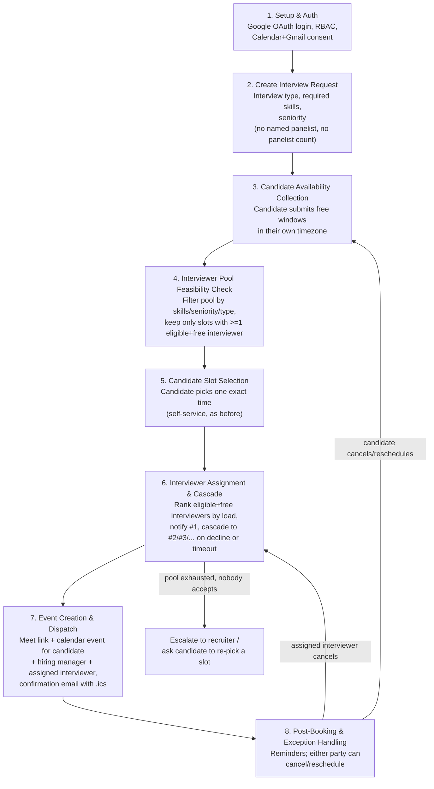

# End-to-End Workflow

This is the agreed shape of the product — the contract every module is built
against. This is the maintained, fully-explained version;
[`workflow.txt`](../workflow.txt) (repo root) mirrors the same stages as a
quick-glance ASCII diagram — if the two ever disagree, this file is right and
`workflow.txt` needs updating to match.

**Revision note (interviewer pooling):** the original design had the recruiter
name specific panelists at creation time. That's changed twice, in sequence:
1. First to "recruiter specifies requirements, broadcast to a matching pool,
   first-to-accept wins."
2. Then simplified further to **deterministic, sequential assignment**: no
   panelist *count* at all (always exactly one interviewer per round), no
   broadcast race — the system ranks eligible-and-free pool members by
   current load and assigns the top one, cascading to the next only on
   decline or timeout.

If you read an earlier version of this doc describing a broadcast/first-
accept-wins claim across multiple simultaneous notifications — that's
superseded by the version below.

## What changed from the original plan

| | Original plan | Now |
|---|---|---|
| Who's on the panel | Recruiter names specific people at creation time | Recruiter specifies requirements only (type, skills, seniority) |
| How many interviewers | Recruiter-specified count, possibly a panel | Always exactly **one** interviewer per round |
| How the interviewer is chosen | N/A | Deterministically ranked: lowest rolling-7-day interview count first, then least-recently-assigned as tiebreak |
| Notification pattern | N/A | **Sequential, one at a time** — not a broadcast to the whole pool. Only the current top-ranked candidate is ever "live." |
| Race condition to guard | Two people booking the same time slot | One interviewer being assigned to two different interviews at overlapping times at nearly the same moment (narrower than an N-way accept race, since only one offer is ever outstanding per interview) |
| Interviewer declines | Recruiter manually finds a replacement | System automatically re-runs the same ranking/cascade for the same fixed time, excluding whoever already declined or backed out |
| Who can cancel/reschedule | Not explicitly specified | Both candidate and the assigned interviewer, each with a distinct downstream effect (see Stage 8) |

## Stage-by-stage

### 1. Setup & Auth — ✅ built, unchanged
See [AUTH_MODULE.md](AUTH_MODULE.md).

### 2. Create Interview Request
Recruiter defines: candidate email + timezone, interview type (e.g.
`TECHNICAL_ROUND_1`), required skills (e.g. `["React", "System Design"]`),
required seniority (e.g. `SENIOR`), duration, buffer. **No panelist is named,
and there's no panelist count** — every request implicitly needs exactly one
interviewer, chosen automatically in Stage 6. A hiring manager, if the round
needs one, is still named explicitly by the recruiter — pooling applies only
to the interviewer role, since a hiring manager is tied to the requisition,
not a rotating pool of equally-qualified people.

### 2B. Interviewer Pool Profile
Every interviewer maintains a profile: skills, seniority level, which
interview types they're qualified to run, and whether they're currently
active in the pool (opted out while on leave, say). Must exist before Stage 4
can filter anyone.

### 3. Candidate Availability Collection
Candidate submits their free time windows, in their own timezone. Has to
happen before Stage 4, which needs something to check the pool's calendars
against.

### 4. Interviewer Pool Feasibility Check
Filter the pool to those matching the request's skills, seniority, and
interview type, and currently active. For each of the candidate's submitted
windows, keep only the ones where **at least one** eligible pool member is
calendar-free — that's what makes a slot offerable at all. Unlike the
broadcast design, we don't need to rank by "how many are free" anymore, since
assignment in Stage 6 only ever needs one — feasibility is binary per slot.

**Decision carried over:** if no submitted window has *any* eligible
interviewer free, surface that explicitly to the recruiter (widen
seniority/skills) or candidate (submit more windows) — not a silent empty result.

### 5. Candidate Slot Selection
Candidate picks one exact time from the feasible list via their invite link.
No interviewer is attached yet — only the fact that at least one exists.

### 6. Interviewer Assignment & Cascade
Once the candidate confirms a time, the system:

1. Computes the eligible-and-free-at-that-exact-time interviewer set (same
   filter as Stage 4, re-checked live in case anything changed).
2. Ranks them: **lowest rolling 7-day confirmed-interview count first**
   (burnout prevention / load balancing); ties broken by **least recently
   assigned** (round-robin fallback). Both numbers are computed live from
   confirmed assignment history, not a stored counter that could drift.
3. Reserves and notifies **only the top-ranked person** — "Accept to
   interview [candidate] for [role] at [time]?"
4. On accept → done, proceed to Stage 7.
   On decline or no response within the timeout window → release that
   reservation, re-rank the remaining candidates (excluding everyone already
   tried for this interview), and notify the new top-ranked person. Repeat.
5. If the eligible pool is exhausted with nobody accepting, escalate to the
   recruiter (widen criteria, manually assign, or ask the candidate to pick a
   different slot).

**Concurrency note:** because only one offer is ever outstanding per
interview, there's no multi-way accept race to guard against. The race that
*is* still possible: two different interviews independently deciding to
offer the same top-ranked interviewer overlapping times, moments apart.
Guarded by a per-interviewer lock taken at the moment an offer is created —
see [DATA_MODEL.md](DATA_MODEL.md#interviewslotoffer-new--module-6).

### 7. Event Creation & Dispatch
Once accepted: create the calendar event (Meet link) and notify everyone —
candidate + the named hiring manager (if any) + the one assigned interviewer.
Confirmation email with `.ics` fallback for non-Google participants.

### 8. Post-Booking & Exception Handling
Reminders before the interview. Cancellation/reschedule, both parties:

- **Candidate cancels or requests a reschedule:** the assigned interviewer's
  reservation is released (their rolling count naturally drops since it's
  computed live, not decremented by hand), and the flow restarts from Stage 3
  with new/updated candidate availability.
- **The assigned interviewer cancels** (declines after accepting, needs to
  back out): the system re-runs Stage 6's ranking/cascade for the *same*
  fixed time, excluding that interviewer. The candidate's confirmed time
  doesn't change unless the pool is exhausted, in which case it escalates the
  same way Stage 6's exhausted-pool case does.

## Deliverable mapping

| Workflow stage | Hackathon minimum deliverable |
|---|---|
| 1 | (prerequisite for all of them) |
| 2, 2B | #1 Interface for creating an interview request |
| 4 | #2 Calendar availability checks (now against a pool, not named people) |
| 3, 5 | #3 Candidate availability collection |
| 4, 5, 6 | #4 Automated slot recommendation and booking — the load-balanced ranking in Stage 6 also covers the **bonus** feature "intelligent interviewer selection based on skills or interview type" as core design, not an add-on |
| 7 | #5 Calendar event creation, #6 Automated communications |
| 6, 8 | #6 Automated communications (offer/reminder/cancellation notices), #7 Conflict detection & rescheduling |

Bonus features intentionally folded into core design: candidate self-service
booking (Stage 5), configurable buffer time (Stage 4), and skill/seniority-
based intelligent interviewer selection with load balancing (Stages 2B, 4, 6).
